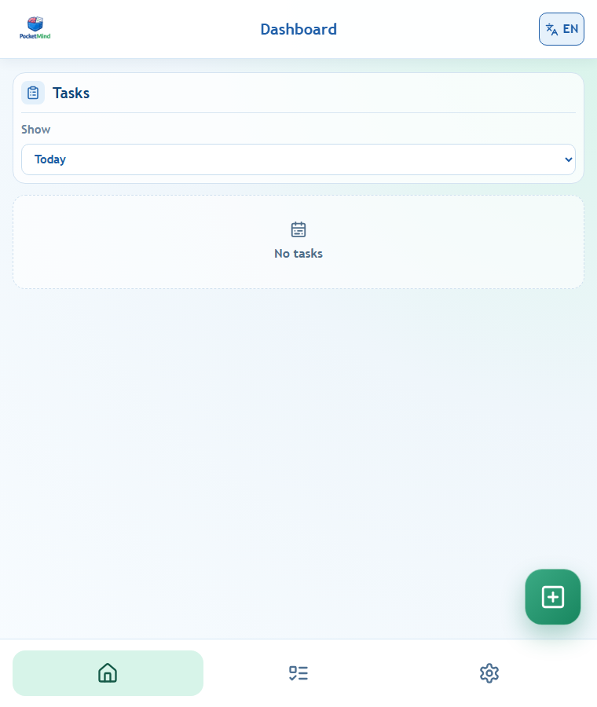
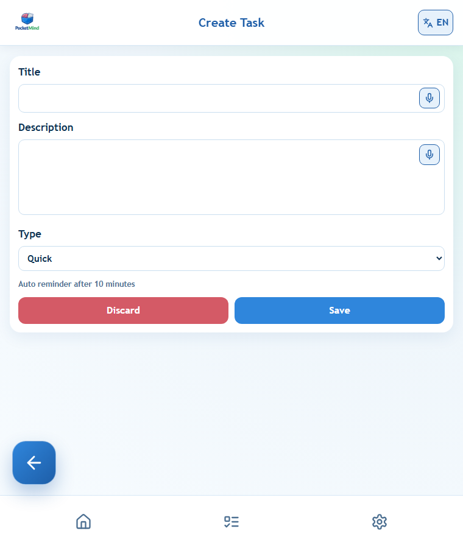
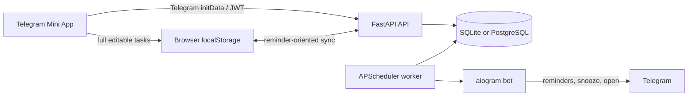

<div align="center">
  
  <h1>PocketMind</h1>
  <p><strong>Capture tasks in a Telegram Mini App and get reminders where you already chat.</strong></p>
  <p>
    <strong>English</strong> · <a href="README.ru.md">Русский</a> · <a href="README.uk.md">Українська</a>
  </p>
  <p>
    <a href="https://github.com/Miha21222/PocketMind/releases/latest">Latest release</a>
    · <a href="CHANGELOG.md">Changelog</a>
    · <a href="https://github.com/Miha21222/PocketMind/issues">Report an issue</a>
  </p>
</div>

> [!IMPORTANT]
> PocketMind is designed to be launched through its configured Telegram bot. Opening the hosted page directly does not provide Telegram authentication. The public bot address is deployment-specific and is not stored in this repository.

PocketMind is a small, local-first task manager for people who want fast capture without leaving Telegram. The browser keeps the editable task state, while the backend synchronizes reminder data and delivers notifications through the bot.

## What it does

- **Flexible task capture:** quick, deadline, waiting, no-deadline, and recurring tasks.
- **Useful views:** dashboard periods, task status/type filters, detail and edit flows.
- **Local-first editing:** create and manage tasks from browser storage even when the backend is temporarily unavailable.
- **Telegram reminders:** snooze a reminder or open its task from the bot; task completion stays in the Mini App.
- **Voice input:** dictate a title or description and transcribe it on the self-hosted backend.
- **Personal preferences:** timezone, quick-task delay, snooze duration, and haptic feedback.
- **Three languages:** English, Russian, and Ukrainian.
- **In-app support:** submit feedback or a bug report with an optional screenshot.

## Start using PocketMind

1. Open the PocketMind deployment's Telegram bot. Send `/start` if this is your first visit, then use the bot's configured menu or Mini App button.
2. Launch the Mini App. Telegram signs you in using Web App `initData`.
3. Tap **New**, enter a title, and choose the task type. Use the microphone buttons if you prefer dictation.
4. Set a deadline, reminder pattern, or recurrence when the selected type supports it, then tap **Save**.
5. Review upcoming work on **Dashboard** or filter everything under **Tasks**.
6. When a reminder arrives in Telegram, **Snooze** it or **Open** the task. Mark tasks done inside the Mini App.

Task edits are saved locally first and synchronized in the background. Reminder delivery, cross-device bootstrap, voice transcription, and feedback submission require the backend.

## Screenshots

The screenshots below were captured from the isolated local preview with an empty browser profile—no production or personal data is shown.

<table>
  <tr>
    <td align="center">
      <br />
      <strong>Dashboard</strong><br />Review work by period and jump into a new task.
    </td>
    <td align="center">
      <br />
      <strong>Quick capture</strong><br />Type or dictate a task and choose its reminder behavior.
    </td>
  </tr>
</table>

## How it works



- The **React + TypeScript + Vite frontend** is a static GitHub Pages build.
- Full task state is owned by the frontend. `LocalTask.id` is the stable `client_task_id` used for synchronization and task links.
- App settings remain in `localStorage`. Each synced task carries a snapshot of the timezone, language, and snooze values needed for reminder delivery.
- The **FastAPI backend** validates Telegram identity and exposes auth, sync, feedback, and voice-transcription APIs.
- The **aiogram bot** and **APScheduler worker** share the backend database with the API.
- The default hosted shape runs API, bot, and scheduler in one supervised backend container, published through Cloudflare Tunnel.

## Local frontend preview

This is the fastest way to explore the UI. It bypasses Telegram auth and the backend, stores data only in browser `localStorage`, and does not deliver real reminders.

**Prerequisite:** Node.js 22 (the version used by CI).

```powershell
# Windows, from the repository root
./scripts/preview-frontend.ps1
```

```sh
# macOS/Linux, from the repository root
./scripts/preview-frontend.sh
```

Or run it directly:

```sh
cd frontend
npm install --cache .npm-cache
npm run dev:local
```

Open <http://localhost:5173>. Use a separate browser profile if you do not want preview tasks mixed with earlier local data.

## Full development setup

### Prerequisites

- Node.js 22 and npm
- Python 3.12+
- A Telegram bot token for authenticated Mini App and reminder testing

Create a single `.env` file at the repository root. Keep it untracked and provide at least the values needed by the processes you run:

| Variable | Purpose |
| --- | --- |
| `BOT_TOKEN` | Telegram bot token from BotFather |
| `MINI_APP_URL` | HTTPS Mini App URL used by bot buttons |
| `JWT_SECRET` | Strong random secret for API access tokens |
| `ENVIRONMENT` | Use `local` for development; production should rely on migrations |
| `DATABASE_URL` | SQLAlchemy URL; defaults to backend SQLite when omitted |
| `CORS_ALLOWED_ORIGINS` | Comma-separated frontend origins allowed by the API |
| `DEFAULT_TIMEZONE` | Fallback IANA timezone, for example `Europe/Kyiv` |
| `SCHEDULER_POLL_INTERVAL_SECONDS` | Reminder polling interval |
| `VITE_API_BASE_URL` | Backend URL including `/api/v1` |
| `VITE_BASE_PATH` | Frontend base path; `/` for local development |
| `TUNNEL_TOKEN` | Cloudflare Tunnel connector token for Compose deployment |

Never commit the root `.env`, tokens, database files, or feedback screenshots.

### Backend API

```powershell
cd backend
python -m venv .venv
.venv\Scripts\Activate.ps1
pip install -r requirements.txt
alembic upgrade head
uvicorn app.main:app --reload --host 0.0.0.0 --port 8000
```

On macOS/Linux, activate the environment with `source .venv/bin/activate`.

In separate terminals, start the bot and scheduler:

```sh
cd backend
python -m app.bot.main
```

```sh
cd backend
python -m app.scheduler.worker
```

### Frontend with the backend

```sh
cd frontend
npm install --cache .npm-cache
npm run dev
```

Telegram requires an HTTPS Mini App URL for real launches. A plain localhost URL is suitable only for browser development.

## Tests and builds

```powershell
# Frontend regression tests
npm.cmd --prefix frontend run test:local

# Type-check and build the frontend
npm.cmd --prefix frontend run build

# Backend test suite
cd backend
python -m unittest discover -s tests -p "test_*.py"

# Validate the hosted Compose definition
cd ..
docker compose config --quiet
```

## API surface

The active backend endpoints are:

- `GET /health`
- `POST /api/v1/auth/telegram`
- `GET /api/v1/sync/bootstrap`
- `GET /api/v1/sync/changes?since=...`
- `PUT /api/v1/sync/tasks/{client_task_id}`
- `DELETE /api/v1/sync/tasks/{client_task_id}`
- `POST /api/v1/sync/batch`
- `POST /api/v1/voice/transcribe`
- `POST /api/v1/feedback`

Protected `/api/v1` endpoints use the JWT issued after Telegram `initData` validation.

## Deployment notes

### Frontend

[`.github/workflows/github-pages.yml`](.github/workflows/github-pages.yml) builds `frontend/dist` on relevant pushes to `main`. Configure the GitHub repository variable `VITE_API_BASE_URL`; the workflow currently sets `VITE_BASE_PATH=/PocketMind/`.

### Backend

[`docker-compose.yml`](docker-compose.yml) builds one backend image and starts it with `cloudflared`:

```sh
docker compose up -d --build
docker compose ps
docker compose logs -f
```

The entrypoint applies Alembic migrations before startup. No host port is exposed; configure the Cloudflare Tunnel service to target `http://backend:8000`. SQLite data persists in the named `pocketmind_data` volume.

> [!CAUTION]
> Back up the persistent volume before upgrades. SQLite is appropriate for the current single-backend deployment. Before scaling database writers or backend replicas, move to PostgreSQL and update the Compose `DATABASE_URL` override—the checked-in Compose file intentionally pins the backend service to its persistent SQLite path.

## Repository map

```text
frontend/                 React Mini App, local task state, UI tests
backend/app/api/v1/       FastAPI auth, sync, voice, and feedback routes
backend/app/bot/          Telegram bot and callback handlers
backend/app/scheduler/    Reminder polling worker
backend/app/services/     Sync, reminder, transcription, and feedback logic
backend/tests/            Backend unittest suite
docs/screenshots/         README images
scripts/                  Frontend-only preview helpers
docker-compose.yml        VPS backend + Cloudflare Tunnel
```

## Data and privacy boundaries

- Task and app-setting data is stored in the browser's `localStorage`; clearing site data can remove the local copy.
- Reminder-relevant task fields and Telegram identity are stored by the configured backend deployment.
- Voice recordings are uploaded to that backend for self-hosted `faster-whisper` transcription.
- Feedback text and optional screenshots are stored by the backend and relayed through the configured Telegram support channel.
- PocketMind is a task-reminder tool, not a guaranteed alerting or emergency-notification system.

## License

No project license is currently declared. Repository access does not by itself grant permission to copy, modify, or redistribute the project. Third-party dependencies remain subject to their own licenses.
