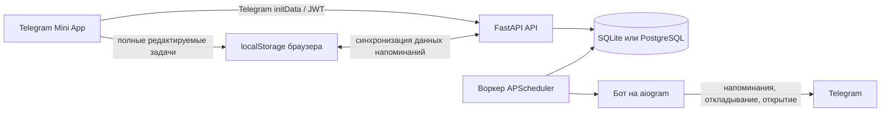

<div align="center">
  
  <h1>PocketMind</h1>
  <p><strong>Записывайте задачи в Telegram Mini App и получайте напоминания там, где уже общаетесь.</strong></p>
  <p>
    <a href="README.md">English</a> · <strong>Русский</strong> · <a href="README.uk.md">Українська</a>
  </p>
  <p>
    <a href="https://github.com/Miha21222/PocketMind/releases/latest">Последний релиз</a>
    · <a href="CHANGELOG.md">История изменений</a>
    · <a href="https://github.com/Miha21222/PocketMind/issues">Сообщить о проблеме</a>
  </p>
</div>

> [!IMPORTANT]
> PocketMind предназначен для запуска через настроенного Telegram-бота. При прямом открытии опубликованной страницы авторизация Telegram недоступна. Публичный адрес бота зависит от конкретного развёртывания и не хранится в этом репозитории.

PocketMind — небольшой локально-ориентированный менеджер задач для тех, кому важно быстро фиксировать дела, не выходя из Telegram. Редактируемое состояние задач хранится в браузере, а бэкенд синхронизирует данные напоминаний и доставляет уведомления через бота.

## Возможности

- **Гибкое создание задач:** быстрые, с дедлайном, в ожидании, без дедлайна и повторяющиеся задачи.
- **Удобные представления:** периоды на дашборде, фильтры по статусу и типу, просмотр и редактирование задач.
- **Локальная работа прежде всего:** создавайте задачи и управляйте ими из хранилища браузера, даже если бэкенд временно недоступен.
- **Напоминания в Telegram:** отложите напоминание или откройте задачу из бота; завершение задач выполняется в Mini App.
- **Голосовой ввод:** надиктуйте заголовок или описание для расшифровки на собственном бэкенде.
- **Личные настройки:** часовой пояс, задержка быстрых задач, длительность откладывания и тактильный отклик.
- **Три языка:** английский, русский и украинский.
- **Поддержка в приложении:** отправьте отзыв или сообщение об ошибке с необязательным скриншотом.

## Начало работы с PocketMind

1. Откройте Telegram-бота вашего развёртывания PocketMind. При первом посещении отправьте `/start`, затем воспользуйтесь настроенным меню бота или кнопкой Mini App.
2. Запустите Mini App. Telegram авторизует вас с помощью Web App `initData`.
3. Нажмите **Новая**, введите заголовок и выберите тип задачи. Для диктовки используйте кнопки микрофона.
4. Если выбранный тип это поддерживает, задайте дедлайн, режим напоминаний или повтор, затем нажмите **Сохранить**.
5. Просматривайте ближайшие дела на **Дашборде** или фильтруйте все задачи в разделе **Задачи**.
6. Когда напоминание придёт в Telegram, **отложите** его или **откройте** задачу. Отмечайте задачи выполненными в Mini App.

Изменения задач сначала сохраняются локально, а затем синхронизируются в фоновом режиме. Для доставки напоминаний, загрузки данных на другом устройстве, распознавания голоса и отправки отзывов необходим бэкенд.

## Скриншоты

Скриншоты ниже сделаны в изолированном локальном режиме с пустым профилем браузера — на них нет рабочих или персональных данных.

<table>
  <tr>
    <td align="center">
      <br />
      <strong>Дашборд</strong><br />Просматривайте дела по периодам и быстро создавайте новую задачу.
    </td>
    <td align="center">
      <br />
      <strong>Быстрое создание</strong><br />Введите или надиктуйте задачу и выберите режим напоминаний.
    </td>
  </tr>
</table>

## Как это работает



- **Фронтенд на React + TypeScript + Vite** собирается в статический сайт для GitHub Pages.
- Полное состояние задач принадлежит фронтенду. `LocalTask.id` — стабильный `client_task_id`, используемый для синхронизации и ссылок на задачи.
- Настройки приложения остаются в `localStorage`. Каждая синхронизированная задача содержит снимок часового пояса, языка и времени откладывания, необходимых для доставки напоминаний.
- **Бэкенд на FastAPI** проверяет личность Telegram и предоставляет API авторизации, синхронизации, обратной связи и распознавания голоса.
- **Бот на aiogram** и **воркер APScheduler** используют общую с API базу данных.
- В стандартной схеме развёртывания API, бот и планировщик работают в одном контейнере бэкенда под управлением supervisor, а публикация выполняется через Cloudflare Tunnel.

## Локальный просмотр фронтенда

Это самый быстрый способ познакомиться с интерфейсом. Режим обходит авторизацию Telegram и бэкенд, хранит данные только в `localStorage` браузера и не доставляет настоящие напоминания.

**Требование:** Node.js 22 — версия, используемая в CI.

```powershell
# Windows, из корня репозитория
./scripts/preview-frontend.ps1
```

```sh
# macOS/Linux, из корня репозитория
./scripts/preview-frontend.sh
```

Или запустите напрямую:

```sh
cd frontend
npm install --cache .npm-cache
npm run dev:local
```

Откройте <http://localhost:5173>. Используйте отдельный профиль браузера, если не хотите смешивать тестовые задачи с ранее сохранёнными локальными данными.

## Полная среда разработки

### Требования

- Node.js 22 и npm
- Python 3.12+
- Токен Telegram-бота для проверки авторизации Mini App и напоминаний

Создайте единый файл `.env` в корне репозитория. Не добавляйте его в Git и укажите как минимум переменные, необходимые запускаемым процессам:

| Переменная | Назначение |
| --- | --- |
| `BOT_TOKEN` | Токен Telegram-бота от BotFather |
| `MINI_APP_URL` | HTTPS-адрес Mini App для кнопок бота |
| `JWT_SECRET` | Надёжный случайный секрет для токенов доступа API |
| `ENVIRONMENT` | Используйте `local` для разработки; в production применяйте миграции |
| `DATABASE_URL` | URL SQLAlchemy; если не задан, используется SQLite бэкенда |
| `CORS_ALLOWED_ORIGINS` | Разделённые запятыми адреса фронтенда, разрешённые API |
| `DEFAULT_TIMEZONE` | Резервный часовой пояс IANA, например `Europe/Kyiv` |
| `SCHEDULER_POLL_INTERVAL_SECONDS` | Интервал опроса напоминаний |
| `VITE_API_BASE_URL` | Адрес бэкенда, включая `/api/v1` |
| `VITE_BASE_PATH` | Базовый путь фронтенда; `/` для локальной разработки |
| `TUNNEL_TOKEN` | Токен коннектора Cloudflare Tunnel для развёртывания через Compose |

Никогда не добавляйте в репозиторий корневой `.env`, токены, файлы базы данных или скриншоты из отзывов.

### API бэкенда

```powershell
cd backend
python -m venv .venv
.venv\Scripts\Activate.ps1
pip install -r requirements.txt
alembic upgrade head
uvicorn app.main:app --reload --host 0.0.0.0 --port 8000
```

В macOS/Linux активируйте окружение командой `source .venv/bin/activate`.

В отдельных терминалах запустите бота и планировщик:

```sh
cd backend
python -m app.bot.main
```

```sh
cd backend
python -m app.scheduler.worker
```

### Фронтенд с бэкендом

```sh
cd frontend
npm install --cache .npm-cache
npm run dev
```

Для настоящего запуска Mini App Telegram требует HTTPS-адрес. Обычный localhost подходит только для разработки в браузере.

## Тесты и сборка

```powershell
# Регрессионные тесты фронтенда
npm.cmd --prefix frontend run test:local

# Проверка типов и сборка фронтенда
npm.cmd --prefix frontend run build

# Набор тестов бэкенда
cd backend
python -m unittest discover -s tests -p "test_*.py"

# Проверка конфигурации Compose для хостинга
cd ..
docker compose config --quiet
```

## Поверхность API

Активные эндпоинты бэкенда:

- `GET /health`
- `POST /api/v1/auth/telegram`
- `GET /api/v1/sync/bootstrap`
- `GET /api/v1/sync/changes?since=...`
- `PUT /api/v1/sync/tasks/{client_task_id}`
- `DELETE /api/v1/sync/tasks/{client_task_id}`
- `POST /api/v1/sync/batch`
- `POST /api/v1/voice/transcribe`
- `POST /api/v1/feedback`

Защищённые эндпоинты `/api/v1` используют JWT, выданный после проверки Telegram `initData`.

## Примечания по развёртыванию

### Фронтенд

[`.github/workflows/github-pages.yml`](.github/workflows/github-pages.yml) собирает `frontend/dist` при соответствующих изменениях в `main`. Настройте переменную репозитория GitHub `VITE_API_BASE_URL`; сейчас workflow задаёт `VITE_BASE_PATH=/PocketMind/`.

### Бэкенд

[`docker-compose.yml`](docker-compose.yml) собирает единый образ бэкенда и запускает его вместе с `cloudflared`:

```sh
docker compose up -d --build
docker compose ps
docker compose logs -f
```

Entrypoint применяет миграции Alembic перед запуском. Порт хоста не публикуется; настройте сервис Cloudflare Tunnel на `http://backend:8000`. Данные SQLite сохраняются в именованном томе `pocketmind_data`.

> [!CAUTION]
> Создавайте резервную копию постоянного тома перед обновлениями. SQLite подходит для текущего развёртывания с единственным экземпляром бэкенда. Перед масштабированием процессов записи в базу данных или реплик бэкенда перейдите на PostgreSQL и обновите переопределение `DATABASE_URL` в Compose — текущий файл Compose намеренно закрепляет для сервиса бэкенда постоянный путь SQLite.

## Структура репозитория

```text
frontend/                 React Mini App, локальное состояние задач, тесты UI
backend/app/api/v1/       Маршруты FastAPI для авторизации, синхронизации, голоса и отзывов
backend/app/bot/          Telegram-бот и обработчики callback-действий
backend/app/scheduler/    Воркер опроса напоминаний
backend/app/services/     Логика синхронизации, напоминаний, распознавания и отзывов
backend/tests/            Набор unittest-тестов бэкенда
docs/screenshots/         Изображения для README
scripts/                  Скрипты локального просмотра фронтенда
docker-compose.yml        Бэкенд для VPS и Cloudflare Tunnel
```

## Границы хранения данных и конфиденциальности

- Данные задач и настройки приложения хранятся в `localStorage` браузера; очистка данных сайта может удалить локальную копию.
- Поля задач, необходимые для напоминаний, и личность Telegram хранятся в настроенном развёртывании бэкенда.
- Голосовые записи загружаются на этот бэкенд для локального распознавания с помощью `faster-whisper`.
- Текст отзывов и необязательные скриншоты сохраняются бэкендом и пересылаются в настроенный канал поддержки Telegram.
- PocketMind — инструмент для задач и напоминаний, а не система гарантированных или экстренных оповещений.

## Лицензия

Лицензия проекта пока не указана. Сам по себе доступ к репозиторию не даёт разрешения копировать, изменять или распространять проект. Сторонние зависимости регулируются собственными лицензиями.
