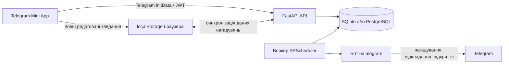

<div align="center">
  
  <h1>PocketMind</h1>
  <p><strong>Записуйте завдання в Telegram Mini App та отримуйте нагадування там, де вже спілкуєтеся.</strong></p>
  <p>
    <a href="README.md">English</a> · <a href="README.ru.md">Русский</a> · <strong>Українська</strong>
  </p>
  <p>
    <a href="https://github.com/Miha21222/PocketMind/releases/latest">Останній реліз</a>
    · <a href="CHANGELOG.md">Історія змін</a>
    · <a href="https://github.com/Miha21222/PocketMind/issues">Повідомити про проблему</a>
  </p>
</div>

> [!IMPORTANT]
> PocketMind призначений для запуску через налаштованого Telegram-бота. Якщо відкрити опубліковану сторінку безпосередньо, авторизація Telegram буде недоступна. Публічна адреса бота залежить від конкретного розгортання й не зберігається в цьому репозиторії.

PocketMind — невеликий локально-орієнтований менеджер завдань для тих, кому важливо швидко фіксувати справи, не виходячи з Telegram. Стан завдань, який можна редагувати, зберігається в браузері, а бекенд синхронізує дані нагадувань і доставляє сповіщення через бота.

## Можливості

- **Гнучке створення завдань:** швидкі, із дедлайном, в очікуванні, без дедлайну та повторювані завдання.
- **Зручні представлення:** періоди на дашборді, фільтри за статусом і типом, перегляд та редагування завдань.
- **Локальна робота передусім:** створюйте завдання й керуйте ними зі сховища браузера, навіть якщо бекенд тимчасово недоступний.
- **Нагадування в Telegram:** відкладіть нагадування або відкрийте завдання з бота; завершення завдань виконується в Mini App.
- **Голосове введення:** продиктуйте заголовок або опис для розшифрування на власному бекенді.
- **Особисті налаштування:** часовий пояс, затримка швидких завдань, тривалість відкладання й тактильний відгук.
- **Три мови:** англійська, російська та українська.
- **Підтримка в застосунку:** надішліть відгук або повідомлення про помилку з необов'язковим знімком екрана.

## Початок роботи з PocketMind

1. Відкрийте Telegram-бота вашого розгортання PocketMind. Під час першого відвідування надішліть `/start`, а потім скористайтеся налаштованим меню бота або кнопкою Mini App.
2. Запустіть Mini App. Telegram авторизує вас за допомогою Web App `initData`.
3. Натисніть **Нове**, введіть заголовок і виберіть тип завдання. Для диктування використовуйте кнопки мікрофона.
4. Якщо вибраний тип це підтримує, задайте дедлайн, режим нагадувань або повторення, а потім натисніть **Зберегти**.
5. Переглядайте найближчі справи на **Дашборді** або фільтруйте всі завдання в розділі **Завдання**.
6. Коли нагадування надійде в Telegram, **відкладіть** його або **відкрийте** завдання. Позначайте завдання виконаними в Mini App.

Зміни завдань спочатку зберігаються локально, а потім синхронізуються у фоновому режимі. Для доставки нагадувань, завантаження даних на іншому пристрої, розпізнавання голосу й надсилання відгуків потрібен бекенд.

## Знімки екрана

Знімки нижче зроблено в ізольованому локальному режимі з порожнім профілем браузера — вони не містять робочих або персональних даних.

<table>
  <tr>
    <td align="center">
      <br />
      <strong>Дашборд</strong><br />Переглядайте справи за періодами та швидко створюйте нове завдання.
    </td>
    <td align="center">
      <br />
      <strong>Швидке створення</strong><br />Введіть або продиктуйте завдання й виберіть режим нагадувань.
    </td>
  </tr>
</table>

## Як це працює



- **Фронтенд на React + TypeScript + Vite** збирається у статичний сайт для GitHub Pages.
- Повний стан завдань належить фронтенду. `LocalTask.id` — стабільний `client_task_id`, який використовується для синхронізації та посилань на завдання.
- Налаштування застосунку залишаються в `localStorage`. Кожне синхронізоване завдання містить знімок часового поясу, мови та часу відкладання, необхідних для доставки нагадувань.
- **Бекенд на FastAPI** перевіряє особу Telegram і надає API авторизації, синхронізації, зворотного зв'язку та розпізнавання голосу.
- **Бот на aiogram** і **воркер APScheduler** використовують спільну з API базу даних.
- У стандартній схемі розгортання API, бот і планувальник працюють в одному контейнері бекенда під керуванням supervisor, а публікація виконується через Cloudflare Tunnel.

## Локальний перегляд фронтенда

Це найшвидший спосіб ознайомитися з інтерфейсом. Режим оминає авторизацію Telegram і бекенд, зберігає дані лише в `localStorage` браузера та не доставляє справжні нагадування.

**Вимога:** Node.js 22 — версія, яку використовує CI.

```powershell
# Windows, із кореня репозиторію
./scripts/preview-frontend.ps1
```

```sh
# macOS/Linux, із кореня репозиторію
./scripts/preview-frontend.sh
```

Або запустіть безпосередньо:

```sh
cd frontend
npm install --cache .npm-cache
npm run dev:local
```

Відкрийте <http://localhost:5173>. Використовуйте окремий профіль браузера, якщо не хочете змішувати тестові завдання з раніше збереженими локальними даними.

## Повне середовище розробки

### Вимоги

- Node.js 22 і npm
- Python 3.12+
- Токен Telegram-бота для перевірки авторизації Mini App і нагадувань

Створіть єдиний файл `.env` у корені репозиторію. Не додавайте його до Git і вкажіть щонайменше змінні, необхідні процесам, які ви запускаєте:

| Змінна | Призначення |
| --- | --- |
| `BOT_TOKEN` | Токен Telegram-бота від BotFather |
| `MINI_APP_URL` | HTTPS-адреса Mini App для кнопок бота |
| `JWT_SECRET` | Надійний випадковий секрет для токенів доступу API |
| `ENVIRONMENT` | Використовуйте `local` для розробки; у production застосовуйте міграції |
| `DATABASE_URL` | URL SQLAlchemy; якщо не задано, використовується SQLite бекенда |
| `CORS_ALLOWED_ORIGINS` | Розділені комами адреси фронтенда, дозволені API |
| `DEFAULT_TIMEZONE` | Резервний часовий пояс IANA, наприклад `Europe/Kyiv` |
| `SCHEDULER_POLL_INTERVAL_SECONDS` | Інтервал опитування нагадувань |
| `VITE_API_BASE_URL` | Адреса бекенда, включно з `/api/v1` |
| `VITE_BASE_PATH` | Базовий шлях фронтенда; `/` для локальної розробки |
| `TUNNEL_TOKEN` | Токен конектора Cloudflare Tunnel для розгортання через Compose |

Ніколи не додавайте до репозиторію кореневий `.env`, токени, файли бази даних або знімки екрана з відгуків.

### API бекенда

```powershell
cd backend
python -m venv .venv
.venv\Scripts\Activate.ps1
pip install -r requirements.txt
alembic upgrade head
uvicorn app.main:app --reload --host 0.0.0.0 --port 8000
```

У macOS/Linux активуйте середовище командою `source .venv/bin/activate`.

В окремих терміналах запустіть бота та планувальник:

```sh
cd backend
python -m app.bot.main
```

```sh
cd backend
python -m app.scheduler.worker
```

### Фронтенд із бекендом

```sh
cd frontend
npm install --cache .npm-cache
npm run dev
```

Для справжнього запуску Mini App Telegram вимагає HTTPS-адресу. Звичайний localhost підходить лише для розробки у браузері.

## Тести та збірка

```powershell
# Регресійні тести фронтенда
npm.cmd --prefix frontend run test:local

# Перевірка типів і збірка фронтенда
npm.cmd --prefix frontend run build

# Набір тестів бекенда
cd backend
python -m unittest discover -s tests -p "test_*.py"

# Перевірка конфігурації Compose для хостингу
cd ..
docker compose config --quiet
```

## Поверхня API

Активні ендпойнти бекенда:

- `GET /health`
- `POST /api/v1/auth/telegram`
- `GET /api/v1/sync/bootstrap`
- `GET /api/v1/sync/changes?since=...`
- `PUT /api/v1/sync/tasks/{client_task_id}`
- `DELETE /api/v1/sync/tasks/{client_task_id}`
- `POST /api/v1/sync/batch`
- `POST /api/v1/voice/transcribe`
- `POST /api/v1/feedback`

Захищені ендпойнти `/api/v1` використовують JWT, виданий після перевірки Telegram `initData`.

## Примітки щодо розгортання

### Фронтенд

[`.github/workflows/github-pages.yml`](.github/workflows/github-pages.yml) збирає `frontend/dist` за відповідних змін у `main`. Налаштуйте змінну репозиторію GitHub `VITE_API_BASE_URL`; зараз workflow задає `VITE_BASE_PATH=/PocketMind/`.

### Бекенд

[`docker-compose.yml`](docker-compose.yml) збирає єдиний образ бекенда та запускає його разом із `cloudflared`:

```sh
docker compose up -d --build
docker compose ps
docker compose logs -f
```

Entrypoint застосовує міграції Alembic перед запуском. Порт хоста не публікується; налаштуйте сервіс Cloudflare Tunnel на `http://backend:8000`. Дані SQLite зберігаються в іменованому томі `pocketmind_data`.

> [!CAUTION]
> Створюйте резервну копію постійного тому перед оновленнями. SQLite підходить для поточного розгортання з єдиним екземпляром бекенда. Перед масштабуванням процесів запису до бази даних або реплік бекенда перейдіть на PostgreSQL і оновіть перевизначення `DATABASE_URL` у Compose — поточний файл Compose навмисно закріплює для сервісу бекенда постійний шлях SQLite.

## Структура репозиторію

```text
frontend/                 React Mini App, локальний стан завдань, тести UI
backend/app/api/v1/       Маршрути FastAPI для авторизації, синхронізації, голосу та відгуків
backend/app/bot/          Telegram-бот і обробники callback-дій
backend/app/scheduler/    Воркер опитування нагадувань
backend/app/services/     Логіка синхронізації, нагадувань, розпізнавання та відгуків
backend/tests/            Набір unittest-тестів бекенда
docs/screenshots/         Зображення для README
scripts/                  Скрипти локального перегляду фронтенда
docker-compose.yml        Бекенд для VPS і Cloudflare Tunnel
```

## Межі зберігання даних і конфіденційності

- Дані завдань і налаштування застосунку зберігаються в `localStorage` браузера; очищення даних сайту може видалити локальну копію.
- Поля завдань, необхідні для нагадувань, та особа Telegram зберігаються в налаштованому розгортанні бекенда.
- Голосові записи завантажуються на цей бекенд для локального розпізнавання за допомогою `faster-whisper`.
- Текст відгуків і необов'язкові знімки екрана зберігаються бекендом і пересилаються до налаштованого каналу підтримки Telegram.
- PocketMind — інструмент для завдань і нагадувань, а не система гарантованих або екстрених сповіщень.

## Ліцензія

Ліцензію проєкту наразі не вказано. Сам по собі доступ до репозиторію не дає дозволу копіювати, змінювати або розповсюджувати проєкт. Сторонні залежності регулюються власними ліцензіями.
